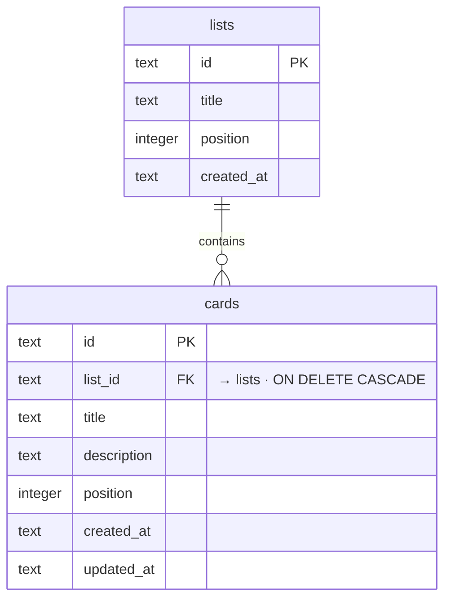

# OpenKanban: The Open-Source Trello Alternative for SaaS

[](https://app.clawnify.com/deploy?repo=clawnify/OpenKanban)

A lightweight kanban board for building project management tools, task trackers, and workflow apps. Part of the [OpenClaw](https://github.com/openclaw/openclaw) ecosystem. No API keys and no third-party services — the whole stack runs on your machine in local dev.

Built with **Preact + Hono + Cloudflare D1**. Ships with a dual-mode UI: one for humans (drag-and-drop cards, hover menus) and one for AI agents (explicit buttons, large targets).

## What Is It?

Clawnify OpenKanban is a production-ready kanban board designed for the OpenClaw community. Think of it as an open-source Trello alternative — a project board you can self-host, customize, and embed in any SaaS product.

Unlike Trello, Asana, or Monday.com, this runs entirely on your own infrastructure with no API keys, no vendor lock-in, and no per-seat pricing. It provides a complete task management and workflow system. Create lists, add cards, drag between columns, and manage projects — all out of the box.

## Features

- **Multiple lists** — create, rename, reorder, and delete columns
- **Drag-and-drop** — move cards between lists with native HTML5 drag
- **Card management** — create, edit, and delete cards with title and description
- **Hover menus** — ellipsis menu on cards for quick actions (human mode)
- **Agent mode** — "Move to" dropdowns, always-visible forms, explicit buttons
- **Colored headers** — 8 rotating colors for visual distinction between lists
- **SQLite persistence** — D1 (SQLite); `pnpm run dev` applies the schema on every start
- **Dual-mode UI** — human-optimized + AI-agent-optimized (`?agent=true`)

## Quickstart

```bash
git clone https://github.com/clawnify/OpenKanban.git
cd OpenKanban
pnpm install
pnpm run dev
```

This starts two processes: Vite on port 5173 (UI) and Wrangler on port 8787 (API).
Open `http://localhost:5173` in your browser.

The board starts empty — use **Add List** to create your first column.

To load the sample board from `demo/seed.sql` instead, run `pnpm run seed`. Note
that this **replaces** the current board contents, so it is safe to re-run but
will discard anything you have added.

Local data lives in `.wrangler/state/v3/d1/` (Miniflare's local D1). Delete that
directory to reset the board.

### Agent Mode (for OpenClaw / Browser-Use)

Append `?agent=true` to the URL:

```
http://localhost:5173/?agent=true
```

This activates an agent-friendly UI with:
- "Move to [list]" dropdowns instead of drag-and-drop
- Always-visible add card forms with labeled inputs
- Explicit "Rename" buttons on list headers
- Larger click targets for reliable browser automation

The human UI stays unchanged — drag-and-drop, hover menus, and inline editing.

## Scripts

| Script | What it does |
|--------|--------------|
| `pnpm run dev` | Applies the schema, then runs Vite (5173) and Wrangler (8787) together |
| `pnpm run build` | Builds the client bundle into `dist/` |
| `pnpm run seed` | Resets the local board and loads `demo/seed.sql` |
| `pnpm run typecheck` | Typechecks client + server with `tsc --noEmit` |

## Tech Stack

| Layer | Technology |
|-------|-----------|
| **Frontend** | Preact, TypeScript, Vite |
| **Backend** | Hono on Cloudflare Workers (Wrangler/Miniflare in dev) |
| **Database** | Cloudflare D1 (SQLite) via `@clawnify/db` |
| **Icons** | Lucide |

### Prerequisites

- Node.js 20+
- pnpm (or npm/yarn)

No Cloudflare account is needed for local development — Wrangler runs D1 locally.

## Architecture

```
src/
  server/
    schema.sql  — D1 schema (lists, cards with positions)
    db.ts       — re-exports the @clawnify/db query helpers
    index.ts    — Hono REST API (lists, cards, move, reorder)
  client/
    app.tsx               — Root component + agent mode detection
    context.tsx           — Preact context for board state
    hooks/use-board.ts    — Board data fetching + mutations
    hooks/use-drag.ts     — HTML5 drag-and-drop logic
    components/
      toolbar.tsx           — Add List button + form
      add-list-column.tsx   — "Add another list" column at the end of the board
      board.tsx             — Horizontal list container
      list.tsx              — List wrapper (column)
      list-header.tsx       — Title, count, rename, delete
      card-list.tsx         — Drop target, card mapping
      card.tsx              — Card with edit mode
      card-menu.tsx         — Ellipsis menu (human mode)
      card-agent-actions.tsx — Move/Edit/Delete (agent mode)
      list-footer.tsx       — Add Card form
```

### Data Model

Two entities with a parent-child relationship:



```sql
lists (id, title, position, created_at)
cards (id, list_id → lists, title, description, position, created_at, updated_at)
```

### API Endpoints

| Method | Endpoint | Description |
|--------|----------|-------------|
| GET | `/api/lists` | Full board (lists with nested cards) |
| POST | `/api/lists` | Create a list |
| PUT | `/api/lists/:id` | Update list title |
| DELETE | `/api/lists/:id` | Delete list + all cards |
| POST | `/api/cards` | Create a card in a list |
| PUT | `/api/cards/:id` | Update card title/description |
| DELETE | `/api/cards/:id` | Delete a card |
| POST | `/api/cards/:id/move` | Move card to another list |

## Community & Contributions

This project is part of the [OpenClaw](https://github.com/openclaw/openclaw) ecosystem. Contributions are welcome — open an issue or submit a PR.

## License

MIT
